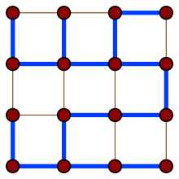
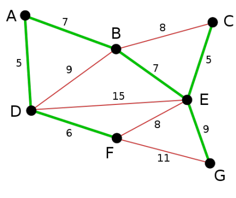

# Spanning trees

A spanning tree in a graph is a subgraph that includes all vertices of G and
is a tree (all vertices are connected and there are no cycles).

# Minimum spanning trees

Minimum spanning tree is a tree of all vertices in a graph whose total weight
of the edges is minimum with respect to the weight of the other spanning trees
of the graph.

## Prim's algorithm

1. Initialize a tree with a single vertex, chosen arbitrarily from the graph.
2. Find the edge with minimum weight that connects a vertex from the tree with one
  that is not yet part of the tree. Add the second vertex to the tree.
3. Repeat 2. until the tree has all vertices of the graph.

## Kruskal's algorithm

1. Create a set of trees F, where each vertex in the graph is a separate tree.
2. Create a set S containing all the edges in the graph.
3. Remove an edge with minimum weight from S. If the removed edge connects two different trees then combine them into a single tree.
4. Repeat 3. while S is nonempty and F does not yet contain all vertices of the graph.
